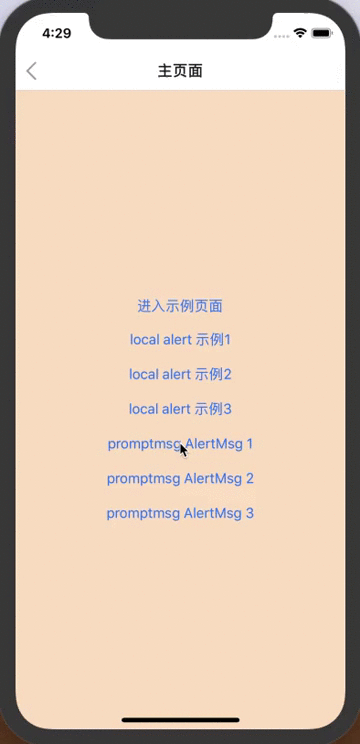

# react-native-promptmsg

[](https://badge.fury.io/js/react-native-promptmsg)

> 使用 react-native 实现的类似iOS上原生的提示对话框样式，支持安卓和iOS。

> 依赖 `react-native-root-siblings`



### 安装

以下两种方式

```bash
$ npm install --save react-native-promptmsg
```
或者
```bash
$ npm install --save https://github.com/RysisLiang/react-native-promptmsg.git
```

### 方法和属性

##### AlertMsg.alert(data:Object, btnNames:Array, btnActions:Array): RootSiblings

显示提示窗（根据传入的参数内容），并返回一个 RootSiblings 类型的对象。

属性

1. data.title: 提示框的标题

2. data.content: 备注内容（可选）

3. btnNames: 按钮的名称列表。按钮个数不同样式不同。
    1. 1个：横向显示一个按钮；
    2. 2个：横向显示两个按钮；
    3. 3个以上：竖排显示多个按钮，最后一个自动添加特殊样式。

4. btnActions: btnNames 和 btnActions 根据 index 一一对应。不传的时候，按钮默认效果都是取消。

##### AlertMsg.close(rs:RootSiblings): void

关闭提示窗（在你需要强制外部关闭时使用，一般情况不需要使用），传入alert获得对象。


### 如何使用
```javascript
import AlertMsg from 'react-native-promptmsg';

// 在你需要的位置
AlertMsg.alert(
  {
      title: '提示',
      content: '备注'
  },
  ['确定', '取消'], 
  [
      () => {
        // to do somethings ...
      }
  ]
);
```
---

**MIT Licensed**